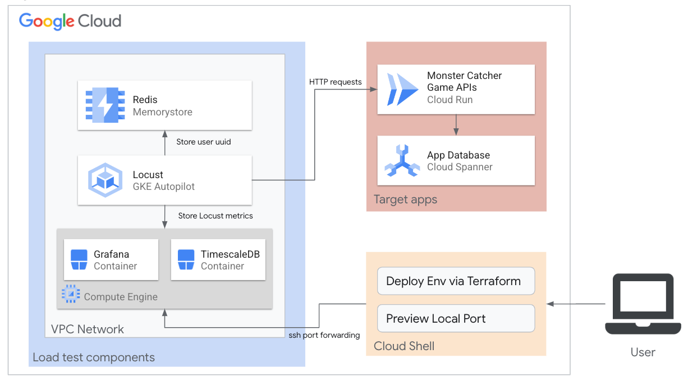

# Spanner Load Test App

This repository contains sample game API code, load test sample code and arroud middleware for distributed load testing:

- Game API server
- Locust load test code
- Setup make file via terraform and gcloud



## Requirements

`Highly recommend`: you to use it on [Cloud Shell](https://cloud.google.com/shell), because of easing to prepare settings for this demo

### Cloud Environment

__We expected to set organization policy default__

- [Google Cloud Project](https://cloud.google.com/resource-manager/docs/creating-managing-projects)
- [Google Account](https://cloud.google.com/iam/docs/overview?hl=ja#google_account)
  - It needs roles/owner permission on your project

__Of course, you can deploy user account, but we recommend you to use Service Account.__

- [Service Account](https://cloud.google.com/iam/docs/creating-managing-service-accounts#creating)
  - It needs roles/owner permission on your project
- [Service Account Key file](https://cloud.google.com/iam/docs/creating-managing-service-account-keys#creating)

```bash
# Example to create account and keyfile
$ export SA_NAME=terraformer
$ export PROJECT_ID=test
# Create Service Account
$ gcloud iam service-accounts create $SA_NAME \
    --description="Operation service account for spanner stress demo" \
    --display-name=$SA_NAME
$ gcloud projects add-iam-policy-binding $PROJECT_ID \
    --member="serviceAccount:${SA_NAME}@${PROJECT_ID}.iam.gserviceaccount.com" \
    --role="roles/owner"
# Download a key file
$ export KEY_FILE=terraformer.json
$ gcloud iam service-accounts keys create $KEY_FILE \
    --iam-account=${SA_NAME}@${PROJECT_ID}.iam.gserviceaccount.com
# We recommend key file type is JSON
```


### Deploy Tools

__Cloud Shell has already installed followings:__

- [gcloud](https://cloud.google.com/sdk/gcloud)
- [terraform](https://www.terraform.io/) (auther version: Terraform v1.2.9 on linux_amd64)
- [make command](https://www.gnu.org/software/make/manual/make.html)
- [envsubst](https://www.gnu.org/software/gettext/manual/html_node/envsubst-Invocation.html)

### Development Tools

If you need to develop this repository, you should install followings: 

- [python](https://www.python.org/downloads/) (auther version: 3.9.2)
  - [pip](https://pip.pypa.io/en/stable/installation/) (auther version: 22.2)
  - [pipenv](https://pipenv.pypa.io/en/latest/) (auther version: 2022.7.24)
- [docker](https://docs.docker.com/engine/install/) (auther version: 20.10.17, API version: 1.41)
- [docker-compose](https://docs.docker.jp/compose/install/index.html) (auther version: version 1.24.0)
- [tbls](https://github.com/k1LoW/tbls) (Optional)
- [terraform-docs](https://github.com/terraform-docs/terraform-docs) (Optional)
- [act](https://github.com/nektos/act) (Optional)

## How to use this demo

### Setup env settings

__You should set own environment by followings:__

```bash
$ git clone https://github.com/kazu0716/spanner-stress-test-demo.git
$ cd spanner-stress-test-demo

# You should change .env_sample to .env for gcloud environment
$ cp .env_sample .env
$ vim .env
# You should edit .env file
```

#### Spesifications of .env file

|                      |                                                                                                                                    |                                                                                                                          | 
| -------------------- | ---------------------------------------------------------------------------------------------------------------------------------- | ------------------------------------------------------------------------------------------------------------------------ | 
| Key name             | Description                                                                                                                        | Example value                                                                                                            | 
| GOOGLE_CLOUD_PROJECT | Google Cloud Project ID                                                                                                            | test                                                                                                                     | 
| ACCOUNTS             | Account list for access to bastion                                                                                                 | ["serviceAccount:terraformer1@test.iam.gserviceaccount.com", "serviceAccount:terraformer2@test.iam.gserviceaccount.com"] | 
| KEY_PATH             | Credential key file path                                                                                                           | ~/workspace/terraformer.json                                                                                             | 
| REGION               | Google Cloud Region you hope                                                                                                       | asia-northeast1                                                                                                          | 
| SERVICE_NAME         | Cloud Run's service name                                                                                                           | sample-game                                                                                                              | 
| INSTANCE_NAME        | Cloud Spanner's instance name                                                                                                      | spanner-demo                                                                                                             | 
| DATABASE_NAME        | Cloud Spanner's database name for testing                                                                                          | sample-game                                                                                                              | 
| ENV                  | Env id, but we expected to use "production" when you deploy on Google Cloud.                                                       | production                                                                                                               | 
| LOG_LEVEL            | Loglevel of app and Locust                                                                                                         | INFO                                                                                                                     | 
| POD_NUM              | The number of Pod for load test containers                                                                                         | 10                                                                                                                       | 
| USERS                | [Peak number of concurrent Locust users](https://docs.locust.io/en/stable/configuration.html#all-available-configuration-options)  | 10                                                                                                                       | 
| RUN_TIME             | [Stop after the specified amount of time](https://docs.locust.io/en/stable/configuration.html#all-available-configuration-options) | 1h                                                                                                                       | 

### Deploy on Google Cloud

```bash
# Create environment via terraform and gcloud
$ make create.cloud.environment

# Run load testing
$ make deploy.locust
```

### Watch the result

__You can check the result in real time by followings:__

- [Google Cloud's operations suite](https://cloud.google.com/products/operations)
  - [Cloud Monitoring](https://cloud.google.com/monitoring/charts/metrics-selector)
  - [Cloud Logging](https://cloud.google.com/logging/docs/view/logs-explorer-interface#getting_started)
  - [Cloud Trace](https://cloud.google.com/trace/docs/viewing-details)

- [Locust plugin dashboard](https://github.com/SvenskaSpel/locust-plugins/blob/master/locust_plugins/dashboards/README.md)


#### How to connect to grafana dashboard

```bash
# SSH port-forwording to grafana
$ make open.grafana
Grafana dashboard: https://3443-xxxxyyyzzzz

# Cloud Shell envronment(You can access via proxy)
$ open https://3443-xxxxyyyzzzz

# Other environment
$ open http://localhost:3443
```

### Change Cloud Spanner cluster size

__Note: If your spanner mark high CPU usage, you should change Cloud Spanner size manually__

- [How to change conpute capacity of Cloud Spanner](https://cloud.google.com/spanner/docs/create-manage-instances?hl=ja#change-compute-capacity)

### Delete all components after tests

```bash
$ make delete.cloud.environment
```

## Features

### Asis

- Rest API for dummy game
  - opperate Cloud Spanner([database schema](./apps/dbdoc/README.md))
- API docs of Swagger by FastAPI
- Distributed Stressor by Locust
- IaC by terraform and gcloud

### Tobe

- [Auto Scalling for Cloud Spanner](https://cloud.google.com/architecture/autoscaling-cloud-spanner), instead of manual scalling

## Reference

### Internal modules reference

- [Sample game app documents](./apps/README.md)
- [Test senario documents by locust](./locust/README.md)
- [Terraform documents](./terraform/README.md)

### 3rd party reference

- [FastAPI](https://fastapi.tiangolo.com/)
- [Locust](https://docs.locust.io/en/stable/)
- [Locust Plugins](https://github.com/SvenskaSpel/locust-plugins)
- [OpenTelemetry FastAPI Instrunentation](https://opentelemetry-python-contrib.readthedocs.io/en/latest/instrumentation/fastapi/fastapi.html)

## Contribution

__Note: Understand [how to check your PR](.github/workflows/action.yml) before you send PR__

- [CONTRIBUTING docs](./docs/contributing.md)

## License

This is [Apache 2.0 License](./LICENSE)

## Note

This is not an officially supported Google product