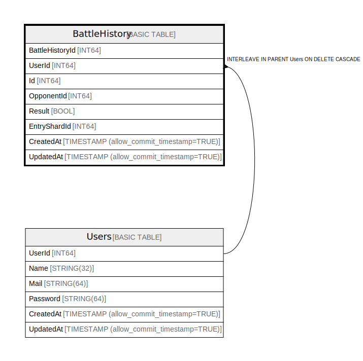

# BattleHistory

## Description

## Columns

| Name | Type | Default | Nullable | Children | Parents | Comment |
| ---- | ---- | ------- | -------- | -------- | ------- | ------- |
| BattleHistoryId | INT64 |  | false |  |  |  |
| UserId | INT64 |  | false |  |  |  |
| Id | INT64 |  | false |  |  |  |
| OpponentId | INT64 |  | false |  |  |  |
| Result | BOOL |  | false |  |  |  |
| EntryShardId | INT64 |  | false |  |  |  |
| CreatedAt | TIMESTAMP (allow_commit_timestamp=TRUE) |  | false |  |  |  |
| UpdatedAt | TIMESTAMP (allow_commit_timestamp=TRUE) |  | false |  |  |  |

## Constraints

| Name | Type | Definition |
| ---- | ---- | ---------- |
| PRIMARY_KEY | PRIMARY_KEY | PRIMARY KEY(UserId, Id, OpponentId, BattleHistoryId) |

## Indexes

| Name | Definition |
| ---- | ---------- |
| IDX_BattleHistory_OpponentId_AB976546A54164F5 | CREATE INDEX IDX_BattleHistory_OpponentId_AB976546A54164F5 ON BattleHistory (OpponentId) |
| IDX_BattleHistory_Id_EEE9F3AC2960E8C4 | CREATE INDEX IDX_BattleHistory_Id_EEE9F3AC2960E8C4 ON BattleHistory (Id) |
| BattleHistoryByUserId | CREATE INDEX BattleHistoryByUserId ON BattleHistory (EntryShardId, UserId, UpdatedAt) |

## Relations

---

> Generated by [tbls](https://github.com/k1LoW/tbls)
