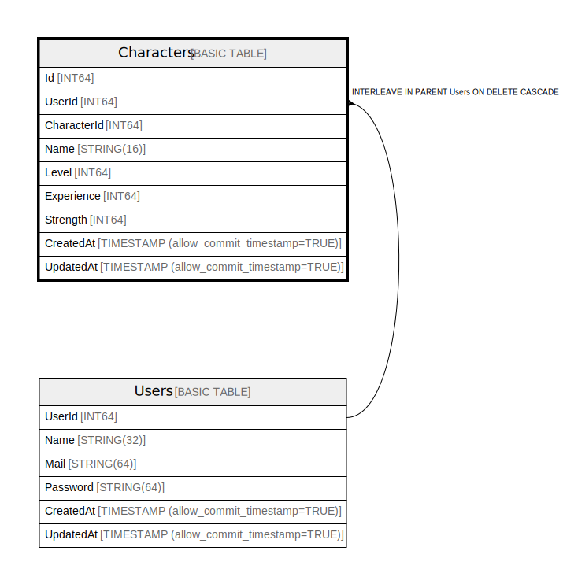

# Characters

## Description

## Columns

| Name | Type | Default | Nullable | Children | Parents | Comment |
| ---- | ---- | ------- | -------- | -------- | ------- | ------- |
| Id | INT64 |  | false |  | [Users](Users.md) |  |
| UserId | INT64 |  | false |  | [Users](Users.md) |  |
| CharacterId | INT64 |  | false |  |  |  |
| Name | STRING(16) |  | false |  |  |  |
| Level | INT64 |  | false |  |  |  |
| Experience | INT64 |  | false |  |  |  |
| Strength | INT64 |  | false |  |  |  |
| CreatedAt | TIMESTAMP (allow_commit_timestamp=TRUE) |  | false |  |  |  |
| UpdatedAt | TIMESTAMP (allow_commit_timestamp=TRUE) |  | false |  |  |  |

## Constraints

| Name | Type | Definition |
| ---- | ---- | ---------- |
| PRIMARY_KEY | PRIMARY_KEY | PRIMARY KEY(UserId, Id) |
| INTERLEAVE | INTERLEAVE | INTERLEAVE IN PARENT Users ON DELETE CASCADE |

## Indexes

| Name | Definition |
| ---- | ---------- |
| IDX_Characters_CharacterId_F504EF5573048058 | CREATE INDEX IDX_Characters_CharacterId_F504EF5573048058 ON Characters (CharacterId) |
| IDX_Characters_Id_U_22D93D488D69425D | CREATE UNIQUE INDEX IDX_Characters_Id_U_22D93D488D69425D ON Characters (Id) |

## Relations

---

> Generated by [tbls](https://github.com/k1LoW/tbls)
