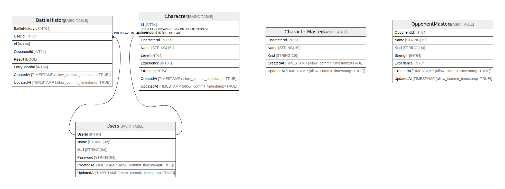

# spanner-demo sample-game

## Tables

| Name | Columns | Comment | Type |
| ---- | ------- | ------- | ---- |
| [BattleHistory](BattleHistory.md) | 8 |  | BASIC TABLE |
| [CharacterMasters](CharacterMasters.md) | 5 |  | BASIC TABLE |
| [Characters](Characters.md) | 9 |  | BASIC TABLE |
| [OpponentMasters](OpponentMasters.md) | 7 |  | BASIC TABLE |
| [Users](Users.md) | 6 |  | BASIC TABLE |

## Relations

---

> Generated by [tbls](https://github.com/k1LoW/tbls)
