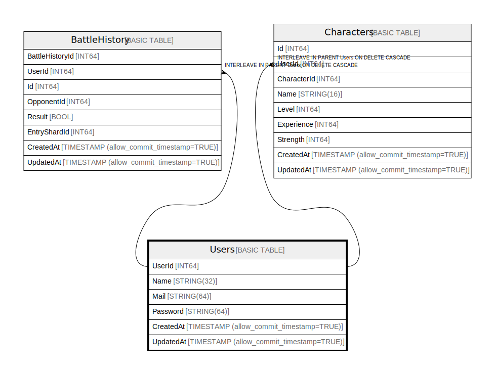

# Users

## Description

## Columns

| Name | Type | Default | Nullable | Children | Parents | Comment |
| ---- | ---- | ------- | -------- | -------- | ------- | ------- |
| UserId | INT64 |  | false | [Characters](Characters.md) |  |  |
| Name | STRING(32) |  | false |  |  |  |
| Mail | STRING(64) |  | false |  |  |  |
| Password | STRING(64) |  | false |  |  |  |
| CreatedAt | TIMESTAMP (allow_commit_timestamp=TRUE) |  | false |  |  |  |
| UpdatedAt | TIMESTAMP (allow_commit_timestamp=TRUE) |  | false |  |  |  |

## Constraints

| Name | Type | Definition |
| ---- | ---- | ---------- |
| PRIMARY_KEY | PRIMARY_KEY | PRIMARY KEY(UserId) |

## Relations

---

> Generated by [tbls](https://github.com/k1LoW/tbls)
